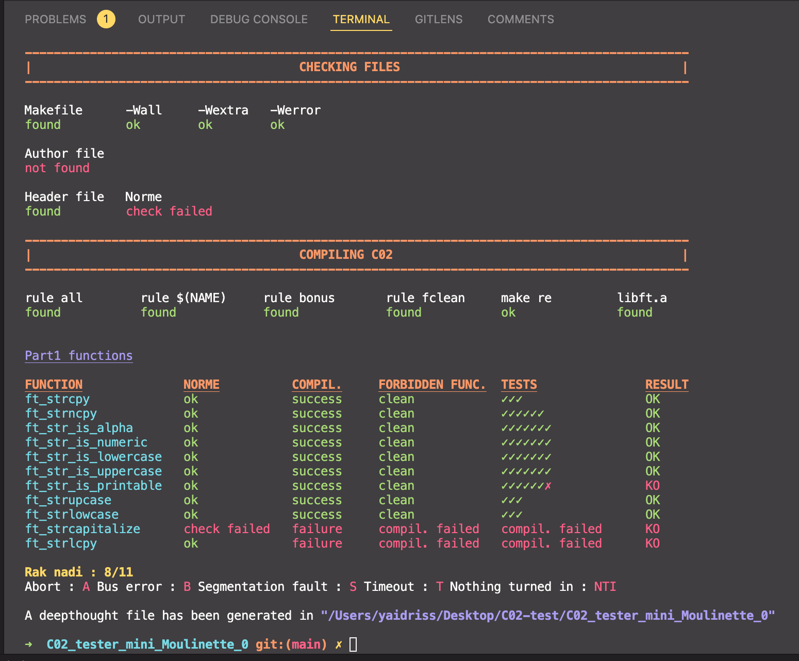

# PREAMBLE
This is an edit of prev C02est made by @yaidriss to fit with the 2022 project C02. <br/>
(ORIGINAL REP : https://github.com/yassineidrissi) <br/>
This update was made by @yaidriss <br/>

# Mini_Moulinette_C02

This repository contains script to test your C02 project.
The script will do the following tests :

- Check if the author file exists
- Check content of the author file
- Compil library
- Check norminette errors
- Check forbidden functions
- Tests functions

At the end of the tests, a deepthought file will be created, inside which you
can find all the results and error/failure messages. You can also see your
results in tests directory.

The script will compil your files with your C02, so you must have your
Makefile up to date.

:warning:All the tests made are not the official tests:warning:

## Getting Started

### Installation

```bash
git clone https://github.com/y3ll0w42/Mini_Moulinette_C02
```

### Configuration

If you run the script for the first time, it will automatically create
`my_config.sh` file and ask you to edit it with the path of your C02
project.
You can also choose the colors that will be used and the path where the
deepthought file will be created.

#### Custom directories

If you use custom directories for your header and source files; you should specify there name in my_config.sh.

The following variables must be set:
```
HEADER_DIR
SRC_DIR
```
Exemple:
```
HEADER_DIR="includes"
SRC_DIR="srcs"
```


## Running script

Go to the directory where you cloned and run the script
```bash
bash grademe.sh
```
or simply run the script with the path
```bash
bash /path/where/you/cloned/grademe.sh
```

### Options available
| Option | Description |
| --- | --- |
| `-h`<br />`--help` | Display help and exit |
| `-d` | Allows to perform the tests even if the files are in directories |
| `-c` | Disable color |
| `-s` | Disable searching Makefile and author files |
| `-m` | When compiling library, test all the Makefile's rules (instead of doing only make re and checking if other rules exist). |


Add successively all options you want, in the order you want.
For example :
```bash
bash grademe.sh ft_strcmpy -f ft_ -n
```

### Supported functions
All the supported functions are listed [on this page](https://github.com/y3ll0w42/Mini_Moulinette_C02/blob/master/supported_functions.md).
## Contribution

Any suggestions or bugs reporting ?
Contact [yassineidrissi.me](yassineidrissi.me)

### Contributors
- yaidriss : https://github.com/yassineidrissi
- tlernoul
# C00_tester_1337
# Mini_Moulinette_C02
